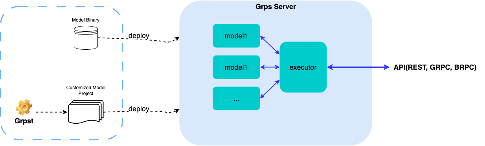

# GRPS(Generic Realtime Predict Service)



## 1. 介绍

一个通用的、稳定的、性能较好的模型在线部署框架，核心目的是帮助用户快速搭建一个在线模型推理服务，将模型部署到线上生产环境，并通过REST/RPC接口方式提供服务。

grps具有如下特性：

* 通用性：通用服务访问接口和自定义框架，自定义拓展不限制模型类型，不限制深度学习框架，不限制前后处理。
* 易用性：内置tensorflow、torch以及tensorrt（支持多流模式）推理后端，可以实现一键快速部署服务，自定义拓展简单。
* 双语言：支持纯c++实现的高性能服务以及python轻量级服务，一键快捷部署功能由纯c++实现。
* 可拓展：提供c++和py两种编程语言自定义工程，用户可以自定义自己的前后处理、模型推理以及http接口格式等。
* 可限制：通过配置方式可以实现tf和torch显存限制功能，适用于共享gpu场景；通过配置方式可以实现服务并发限制。
* 可监控：提供用户日志系统，内置指标监控系统，内置简洁的web图形展示页面，可以便捷的观测qps、延迟、cpu、gpu使用情况等。
* 灵活访问方式：自动适配http、gRPC、bRPC（不支持py自定义工程）访问方式，提供py、c++、java等客户端样例。
* Batching：支持dynamic batching，充分利用gpu资源，提高推理性能与吞吐。
* Streaming：支持模型持续推理并返回结果，适用于自然语言生成、视频处理等场景。
* 多模型支持：支持部署多个模型，多个模型可以组合成一个服务或者单独提供服务。
* 多卡支持：支持配置方式选择gpu部署模型，支持监控多gpu使用情况。
* 更好的性能：通过rpc支持、纯c++服务支持、tensorrt多流推理支持、dynamic batching支持等等，使得服务能够达到更高的性能。

## 2. 目录结构

```
|--apis: 接口定义
|--deps: 环境依赖
|--docker: docker相关
|--docs: 文档
|--grpst: grps工具链
|--server: grps server实现
|--template: grps自定义工程模板
|--grps_client_env.sh: grps client环境配置脚本
|--grps_client_install.sh: grps client安装脚本
|--grps_env.sh: grps环境配置脚本
|--grps_install.sh: grps安装脚本
```

## 3. 文档教程

* [快速开始](./docs/1_QuickStart.md)
* [接口说明](./docs/2_Interface.md)
* [grpst工具使用说明](./docs/3_Grpst.md)
* [快捷部署](./docs/4_QuickDeploy.md)
* [自定义模型工程](./docs/5_Customized.md)
* [前后处理转换器](./docs/6_InternalConverter.md)
* [模型推理后端](./docs/7_InternalInferer.md)
* [客户端说明](./docs/8_Client.md)
* [日志系统](./docs/9_Logger.md)
* [服务指标监控说明](./docs/10_Monitor.md)
* [自定义HTTP](./docs/11_CustomizedHttp.md)
* [Streaming](./docs/12_Streaming.md)
* [Batching](./docs/13_Batching.md)
* [多模型支持](./docs/14_MultiModels.md)
* [服务限制](./docs/15_ServiceLimit.md)
* [docker部署](./docs/16_DockerDeploy.md)
* [从源码构建](./docs/17_BuildFromSources.md)
* [远程开发与调试](./docs/18_RemoteDev.md)
* [镜像列表](./docs/19_ImageList.md)
* [Dlp环境开发](./docs/97_DlpDevelop.md)
* [Horizon部署](./docs/98_HorizonDeploy.md)
* [FAQ](./docs/90_FAQ.md)

## 4. TODO

框架在持续开发中，计划在未来版本支持：

* 支持更多的推理后端，例如onnx-runtime、vllm、tensorrt-llm等。
* 支持更多batching算法，例如continuous batching。
* 支持分布式组装服务，由多个推理后端组装成完整服务。
* 模型推理性能分析工具。
