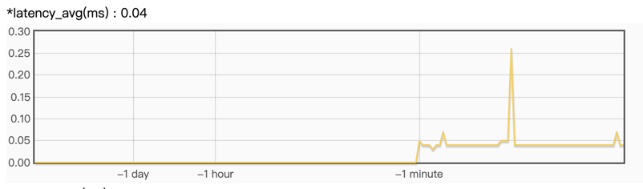
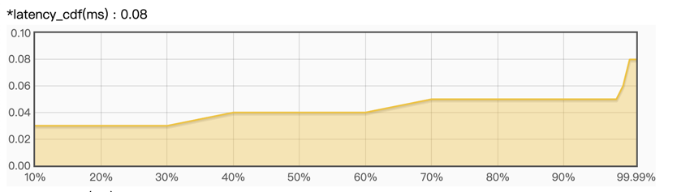

# 服务指标监控说明

grps服务内置了指标系统，包含指标收集与展示。服务默认收集cpu、gpu、mem、qps、latency等指标信息，同时也支持用户在自定义工程中加入自己的指标收集。

1. [指标收集](#指标收集)
2. [指标展示](#指标展示)
3. [文件dump](#文件dump)

## 指标收集

用户可以调用monitor相关api加入自己的指标收集，并且提供了不同的指标数据统计公式，统计按每秒执行一次，包含：

* max：求最大值。
* min：求最小值。
* avg：求平均值。
* inc：求累加值。
* cdf：求累积分布值。

### py api

```python
from grps_framework.monitor.monitor import app_monitor

app_monitor.max('metrics_name', value)  # Monitor metrics with max aggregation.
app_monitor.min('metrics_name', value)  # Monitor metrics with min aggregation.
app_monitor.avg('metrics_name', value)  # Monitor metrics with avg aggregation.
app_monitor.inc('metrics_name', value)  # Monitor metrics with inc aggregation.
app_monitor.cdf('metrics_name', value)  # Monitor metrics with cdf aggregation.
```

### c++ api

```c++
#include "monitor/monitor.h"

// Monitor metrics with increase aggregation.
MONITOR_INC(name, value);
// Monitor metrics with max aggregation.
MONITOR_MAX(name, value);
// Monitor metrics with min aggregation.
MONITOR_MIN(name, value);
// Monitor metrics with avg aggregation.
MONITOR_AVG(name, value);
// Monitor metrics with cdf(continuous distribution function) aggregation.
MONITOR_CDF(name, value);
```

## 指标展示

grps提供一个简单清晰的指标观测前端，用户可以通过web页面查看指标信息以及指标变化，使用服务http根路径（http://host:
port/）访问即可。

### 变化趋势展示



### cdf展示



## 文件dump

所有指标也会每秒刷新到日志文件中，日志文件路径为```grps_monitor.log```，如下：

```text
*mem_usage(%) : 0.26
*latency_cdf(ms)_80 : 0.05
*latency_cdf(ms)_90 : 0.05
*latency_cdf(ms)_99 : 0.06
*latency_cdf(ms)_999 : 0.06
*latency_cdf(ms)_9999 : 0.41
*gpu0_usage(%) : 0.00
*qps : 2566.00
*gpu0_mem_usage(MIB) : 1421.00
*latency_avg(ms) : 0.04
*fail_rate(%) : 0.00
*cpu_usage(%) : 74.17
*latency_max(ms) : 0.41
```
