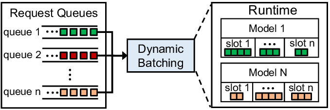

# Batching

grps目前支持dynamic batching，该模式下，对于请求不会立即处理，而是通过动态组装batch
tensor的方式合并请求进行一次模型推理，这样可以充分使用GPU计算资源，对于吞吐量的提升比较明显。



## 快捷部署

通过以下参数可以快速部署支持batching的服务：

```bash
--batching_type dynamic # 打开dynamic batching模式
--max_batch_size 16 # 设置dynamic batching max batch size为16
--batch_timeout_us 2000 # 设置batching组装超时时间为2ms
```

## 自定义模型工程

通过配置文件```inference.yml```配置每一个模型推理的batching模式，如下：

```yaml
models:
  - name: your_model
    ...
    batching: # Batching config.
      type: none # `none`, `dynamic`.
      max_batch_size: 16 # Maximum batch size.
      batch_timeout_us: 1000 # Maximum waiting time for batching in milliseconds.
```

用户需要实现对应的```Converter::BatchPreProcess```、```Converter::BatchPostProcess```以及```ModelInferer::BatchInfer```
接口。

## 性能提升

通过batching模式，可以有效提升服务性能，例如使用[resnet-50-tf](https://github.com/NetEase-Media/grps_examples/tree/master/cpp_examples/resnet-50-tf)
做测试，结果如下：
环境：

```
镜像：registry.cn-hangzhou.aliyuncs.com/opengrps/grps_gpu:grps1.1.0_cuda10.1_cudnn7.6.5_tf2.3.0_torch1.8.1_py3.7
GPU：K80
Max batch size: 16
```

Latency:

| 模式 \ latency(ms) \ 并发 | 1      | 2      | 4        | 8       | 16      | 32      |
|-----------------------|--------|--------|----------|---------|---------|---------|
| 普通模式                  | 44.08  | 37.29  | 64.57    | 134.56  | 263.23  | 545.6   |
| dynamic batching[16]  | 45.19	 | 37.96	 | 49.39	   | 88.13	  | 168.8	  | 349.72  |
| 同比                    | 2.52%  | 1.80%	 | -23.51%	 | -34.51% | -35.87% | -35.90% |

显存:

| 模式 \ GPU显存(MB) \ 并发  | 1     | 2     | 4     | 8     | 16    | 32   |
|----------------------|-------|-------|-------|-------|-------|------|
| 普通模式                 | 4337  | 4337  | 4337  | 4337  | 4337  | 4337 |
| dynamic batching[16] | 4337	 | 4337	 | 4337	 | 4337	 | 4337	 | 4337 |

GPU使用率:

| 模式 \ GPU使用率(%) \ 并发  | 1   | 2   | 4   | 8   | 16  | 32 |
|----------------------|-----|-----|-----|-----|-----|----|
| 普通模式                 | 49  | 80  | 97  | 97  | 97  | 97 |
| dynamic batching[16] | 51	 | 78	 | 93	 | 97	 | 97	 | 97 |

## 自定义样例

* [resnet-50-tf](https://github.com/NetEase-Media/grps_examples/tree/master/cpp_examples/resnet-50-tf)
* [resnet-50-torch](https://github.com/NetEase-Media/grps_examples/tree/master/cpp_examples/resnet-50-torch)
* [resnet-50-trt](https://github.com/NetEase-Media/grps_examples/tree/master/cpp_examples/resnet-50-trt)
* [resnet-50-tf](https://github.com/NetEase-Media/grps_examples/tree/master/py_examples/resnet-50-tf)
* [resnet-50-torch](https://github.com/NetEase-Media/grps_examples/tree/master/py_examples/resnet-50-torch)
* [resnet-50-trt](https://github.com/NetEase-Media/grps_examples/tree/master/py_examples/resnet-50-trt)
