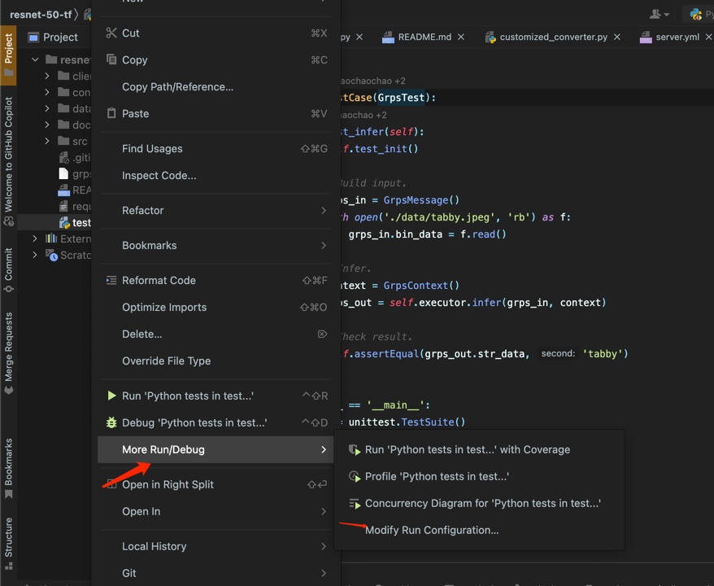

# 远程开发与调试

一般来说，如果我们仅是为了代码补全方便，其实不用构建远程开发和调试环境，因为我们自定义工程中以及有了相关依赖，例如python自定义工程里的grps_server_framework-*
-py3-none-any.whl，我们可以直接安装这个依赖包即可有代码提示，C++自定义工程使用ide加载cmake后则直接就有代码提示。即我们可以在自己的pc端上进行写代码，在远程docker容器中进行调试、构建和以及部署。

但是我们也可以进一步使用ide连接远程docker容器使用容器中的环境进行开发和调试，同时也可以加入断点进行调试。下面以pycharm和clion为例进行说明，vscode类似。

* [远程开发环境准备](#1-远程开发环境准备)
* [IDE远程连接](#2-ide远程连接)
    * [Pycharm](#pycharm)
    * [Clion](#clion)
* [构建、运行与断点调试](#3-构建运行与断点调试)
    * [Pycharm](#pycharm-1)
    * [Clion](#clion-1)

## 1. 远程开发环境准备

```bash
# 安装openssh-server以及rsync
apt update && apt install -y openssh-server rsync

# 修改ssh端口以及配置
vim /etc/ssh/sshd_config
# 在最后添加如下两行
'''
Port 2222  # ssh端口号
PermitRootLogin yes  # 允许root用户登录
'''

# 给root用户加入密码
passwd

# 启动ssh服务
service ssh start
```

## 2. IDE远程连接

我们使用ide打开我们的自定义工程。

### Pycharm

1. 打开Pycharm，选择File->Settings->Project:xxx->Python Interpreter，点击右上角的齿轮，选择Add，选择SSH Interpreter。
2. 填写远程服务器信息，如下图所示：<br>
   
3. 选择远程解释器，如下图所示：<br>
   
4. 修改映射路径，打开自动上传，本地修改代码后会自动替换远程代码，如下图所示：<br>
   
5. 点击OK，完成配置，正确的解释器会显示如下：<br>
   
6. 之后等待pycharm同步完代码和环境后即可正常开发调试，书写代码会有代码提示。

### Clion

1. 打开Clion，选择File->Settings->Build, Execution, Deployment->Toolchains，点击右上角的+，选择Remote Host。
2. 填写远程服务器信息，如下图所示：<br>
   
3. 连接正常后会检测cmake以及gcc编译工具，如下显示：<br>
   
4. 进入CMake页面，Toolchain选择刚刚添加的Remote Host，并设置cmake构建选项以及环境变量，如下图所示：<br>
   
    1. cmake构建选项根据工程的.config文件添加如下选项：
       ```
       -DCUDA_ENABLE=1或0
       -DTORCH_ENABLE=1或0
       -DLIBTORCH_PATH=/usr/local/libtorch 
       -DTF_ENABLE=1或0
       -DLIBTENSORFLOW_PATH=/usr/local/libtensorflow
       -DTRT_ENABLE=1或0
       -DLIBTENSORRT_PATH=/usr/local/libtensorrt
       ```
    2. 环境变量从远程服务器获取，在终端中输入```env```获取所有环境变量并拷贝，按如下图所示粘贴到clion cmake环境变量中：<br>
       
5. 配置完上述内容后，点击OK，clion会自动完成Cmake工程的加载，如下图所示：<br>
   

## 3. 构建、运行与断点调试

### Pycharm

1. 创建一个pytest配置，这里注意我们仅测试“_test.MyTestCase.test_infer_”一个case，如下图所示：<br>
   

   

2. 直接点击run即可，运行的即是我们的单测（test.py）,如下图所示：<br>
   

3. 断点调试仅需要我们在pycharm中加入断点后再点击debug即可，如下图所示：<br>
   

### Clion

1. 必要时先在终端中执行```grpst archive```更新一下grps framework lib为当前环境的版本。
2. 创建一个gtest配置，注意工作目录填写为“_$ContentRoot$_”，如下图所示：<br>
   

   
3. 直接点击run即可，运行的即是我们的单测（src/main.cc）,如下图所示：<br>
   

4. 断点调试仅需要我们在clion中加入断点后再点击debug即可，如下图所示：<br>
   _
