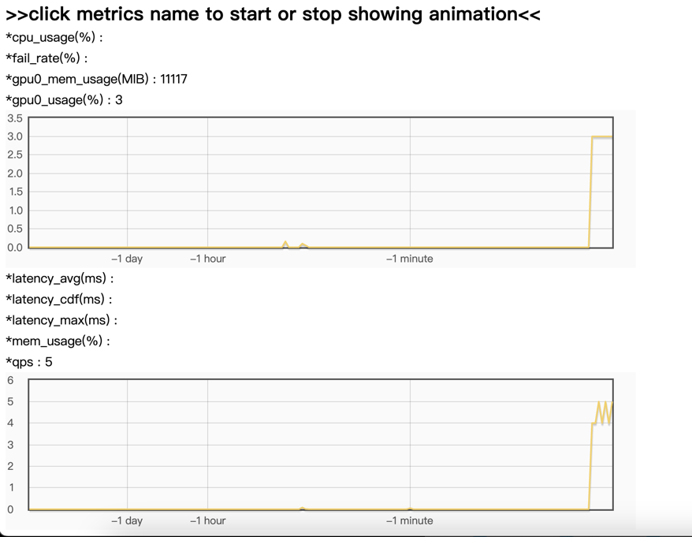

# 快捷开始

本章节介绍如何在grps开发环境进行模型快捷部署以及自定义模型工程部署。

1. [获取grps开发环境](#获取grps开发环境)
2. [快捷部署模型服务](#快捷部署模型服务)
3. [自定义模型工程部署](#自定义模型工程部署)

## 获取grps开发环境

从grps docker[镜像列表](19_ImageList.md)中选择所需的版本号镜像，选择gpu版需要注意对应的显卡驱动版本能否支持对应的cuda版本。
这里使用registry.cn-hangzhou.aliyuncs.com/opengrps/grps_gpu:grps1.1.0_cuda10.1_cudnn7.6.5_tf2.3.0_torch1.8.1_py3.7为例。

```bash
docker pull registry.cn-hangzhou.aliyuncs.com/opengrps/grps_gpu:grps1.1.0_cuda10.1_cudnn7.6.5_tf2.3.0_torch1.8.1_py3.7
# 映射端口7080(http)和7081(rpc)，用于客户端请求
docker run -it --rm --runtime=nvidia --name "grps_dev" -p 7080:7080 -p 7081:7081 registry.cn-hangzhou.aliyuncs.com/opengrps/grps_gpu:grps1.1.0_cuda10.1_cudnn7.6.5_tf2.3.0_torch1.8.1_py3.7 bash
```

## 快捷部署模型服务

这里以torch模型服务为例，介绍快捷服务部署、客户端请求以及服务指标查看。<br>
更多快捷部署样例见：[quick_examples](https://github.com/NetEase-Media/grps_examples/tree/master/quick_examples)
，包含tensorflow、torch等模型快捷部署以及http和rpc客户端代码。

### resnet-50-torch

准备[resnet-50模型相关文件](https://github.com/NetEase-Media/grps_examples/tree/master/cpp_examples/resnet-50-torch/data)。
其中包含了torch jit script model格式的模型文件、label文件以及客户端请求样例图片。

```bash
# 下载模型文件
apt update && apt install git-lfs
git lfs clone https://github.com/NetEase-Media/grps_examples.git
cd grps_examples/cpp_examples/resnet-50-torch/data

# 启动服务
# 部署成功后会自动跟踪日志，可以使用ctrl+c退出跟踪
grpst torch_serve ./resnet50_pretrained.pt

# 使用grpst ps查看服务状态
grpst ps
# 输出如下：
PORT(HTTP,RPC)      NAME                PID                 DEPLOY_PATH
7080,7081           my_grps             138949              /root/.grps/my_grps
```

书写客户端代码(client.py)如下：

```python
import numpy as np
import requests
import cv2

# 加载label
with open('./ImageNetLabels.txt') as f:
    synset = f.readlines()

# 使用opencv解析图片为torch tensor
img = cv2.imread('./tabby.jpeg')
img = cv2.resize(img, (224, 224))
img = img.astype(np.float32) / 255.0
img = img[:, :, ::-1]  # BGR -> RGB
img = (img - np.array([0.485, 0.456, 0.406])) / np.array([0.229, 0.224, 0.225])  # normalize
img = np.transpose(img, (2, 0, 1))  # (224, 224, 3)
img = np.expand_dims(img, axis=0)  # (1, 3, 224, 224)

# 准备ndarray格式的请求
req_data = {'ndarray': img.tolist()}

# 请求服务，以ndarray格式返回结果
response = requests.post('http://127.0.0.1:7080/grps/v1/infer/predict?return-ndarray=true', json=req_data)
scores = response.json()['ndarray']

# scores转label
scores = np.array(scores)[0]
top1 = np.argmax(scores)
print('label: ' + synset[top1])  # 输出label: tabby
```

执行客户端代码：

```bash
apt update && apt install libgl1-mesa-glx -y
pip3 install opencv-python
# 输出label: tabby
python3 client.py
```

登录(http://host:7080/) 可以观测服务指标：<br>


关闭服务：

```bash
grpst stop my_grps
```

## 自定义模型工程部署

这里以自定义python模型工程为例简要说明自定义模型工程的流程，包含创建工程、自定义、打包、部署、模拟请求等。<br>
完整自定义模型说明见：[5_Customized.md](5_Customized.md)。<br>
更多自定义模型工程样例见：[cpp_examples](https://github.com/NetEase-Media/grps_examples/tree/master/cpp_examples)，[py_examples](https://github.com/NetEase-Media/grps_examples/tree/master/py_examples)。

### 简易自定义模型服务

我们实现一个y = 2 * x的功能，输入和输出使用str_data格式（完整消息格式见[2_Interface.md](2_Interface.md)）。

创建py自定义工程：

```bash
grpst create my_grps

# 选择自定义工程模板，如下提示，也可以直接使用--project_type参数指定。
Select project type.
[1] "py": python project with pytorch, tf and trt support.
[2] "cpp": c++ project without nn lib support.
[3] "cpp_torch": c++ project with libtorch support.
[4] "cpp_tf": c++ project with libtensorflow support.
[5] "cpp_trt": c++ project with libtensorrt support.
Please input number(1-5), default is "1":
1

cd my_grps
```

修改转换器(src/customized_converter.py)前后处理函数：

```python
def preprocess(self, inp: GrpsMessage, context: GrpsContext):
    x = int(inp.str_data)
    return x


def postprocess(self, inp, context: GrpsContext) -> GrpsMessage:
    out = GrpsMessage()
    out.str_data = str(inp)
    return out
```

修改推理器(src/customized_inferer.py)推理函数：

```python
def infer(self, inp, context: GrpsContext):
    return 2 * inp
```

修改单测(test.py)：

```python
class MyTestCase(GrpsTest):
    def test_infer(self):
        self.assertGreater(len(converter_register.converter_dict), 0)
        self.assertGreater(len(inferer_register.model_inferer_dict), 0)
        self.test_init()

        # Infer.
        grps_in = GrpsMessage(str_data='2')
        context = GrpsContext()
        grps_out = self.executor.infer(grps_in, context)
        self.assertEqual(context.has_err(), False)
        self.assertEqual(grps_out.str_data, '4')
```

打包为mar（model archived）格式：

```bash
# 打包会首先执行单测，单测通过后才会打包
grpst archive .
```

部署：

```bash
# 启动服务
# 部署成功后会自动跟踪日志，可以使用ctrl+c退出跟踪
# 如需修改端口、接口模式等服务参数，可以修改server.yml配置文件，跟上"--server_conf=./conf/server.yml"参数，可以跳过重新构建直接部署
grpst start server.mar

# 使用grpst ps查看服务状态
grpst ps
# 输出如下：
PORT(HTTP,RPC)      NAME                PID                 DEPLOY_PATH
7080,7081           my_grps             138949              /root/.grps/my_grps
```

模拟请求：

```bash
# curl命令请求，使用http端口
curl -X POST -H "Content-Type:application/json" -d '{"str_data": "2"}' http://0.0.0.0:7080/grps/v1/infer/predict
# 返回结果如下：
{
 "status": {
  "code": 200,
  "msg": "OK",
  "status": "SUCCESS"
 },
 "str_data": "4"
}                                                                                                                   
```

亦可以登录(http://host:7080/) 观测服务指标，效果见快捷部署模型服务截图。

关闭服务：

```bash
grpst stop my_grps

# 退出开发容器
exit
```
