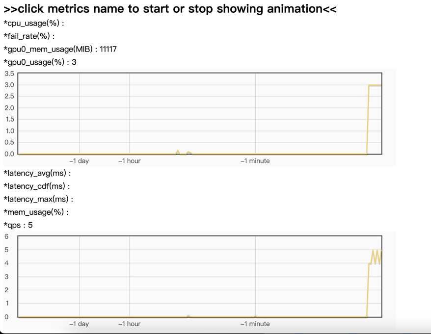

# 自定义模型工程

本章节将详细介绍如何构建自己的grps自定义模型工程，实现自己的自定义模型，支持c++和python两种编程语言。<br>

1. [模型组成部分](#模型组成部分)
2. [创建自定义模型工程](#创建自定义模型工程)
3. [自定义](#自定义)
    1. [py自定义工程](#py自定义工程)
    2. [cpp自定义工程](#cpp自定义工程)
    3. [torch/tensorflow/tensorrt tensor与generic tensor互相转换](#torchtensorflowtensorrt-tensor与generic-tensor互相转换)
    4. [上下文参数功能](#上下文参数)
        1. [放置和获取用户数据](#1-放置和获取用户数据)
        2. [设置错误信息](#2-设置错误信息)
        3. [streaming流式返回](#3-streaming流式返回)
        4. [实现自定义http请求获取和返回](#4-实现自定义http请求获取和返回)
        5. [检测链接是否断开](#5-检测链接是否断开)
    5. [配置文件详细说明](#配置文件详细说明)
4. [构建打包](#单元测试并构建打包为marmodel-archived格式)
5. [部署](#部署)
6. [客户端请求](#客户端请求)
7. [观测服务指标](#观测服务指标)
8. [关闭服务](#关闭服务)
9. [样例](#样例)

## 模型组成部分

一个模型包含两部分：converter、inferer：

* converter：前后处理转换器，包含一次推理的前后处理行为，例如cv图片分类场景的图片解码以及label映射，nlp场景的tokenizer编解码等。
* inferer：深度学习模型推理器，包含模型加载和推理行为。

```text
                        |-------------------------------------------------------|
                        |                        Model                          |
                        |-------------------------------------------------------|
                        |                                                       |
                        |              |-----------|          |--------------|  |
input(GrpsMessage)      | preprocess   | Converter |          |    Inferer   |  |
   --------->           | -----------> |-----------|  infer   |--------------|  |
                        |              |           |  ------> |              |  |
output(GrpsMessage)     | postprocess  |           |  <------ |              |  |
   <---------           | <----------- |           |          |              |  |
                        |              |-----------|          |--------------|  |
                        |                                                       |
                        |-------------------------------------------------------|
```

## 创建自定义模型工程

使用```grpst create```命令创建自定义模型工程。<br>
支持如下几类工程模板可供选择：

* py: python工程，支持pytorch、tensorflow、tensorrt。
* cpp: c++工程，不支持libtorch和libtf。
* cpp_torch: c++工程，支持libtorch。
* cpp_tf: c++工程，支持libtensorflow。
* cpp_trt: c++工程，支持libtensorrt。

```bash
grpst create ./my_grps

# 选择自定义工程模板，如下提示，也可以直接使用--project_type参数指定。
Select project type.
[1] "py": python project with pytorch, tf and trt support.
[2] "cpp": c++ project without nn lib support.
[3] "cpp_torch": c++ project with libtorch support.
[4] "cpp_tf": c++ project with libtensorflow support.
[5] "cpp_trt": c++ project with libtensorrt support.
Please input number(1-5), default is "1":

cd my_grps
```

## 自定义

### py自定义工程

#### 1. 工程架构

```text
|-- client                                      # 客户端样例
|-- conf                                        # 配置文件
|   |-- inference.yml                           # 推理配置
|   |-- server.yml                              # 服务配置
|-- data                                        # 数据文件
|-- src                                         # 自定义源码
|   |-- customized_converter.py                 # 自定义前后处理转换器
|   |-- customized_inferer.py                   # 自定义推理器
|-- grps_framework-*-py3-none-any.whl           # grps框架依赖包
|-- requirements.txt                            # 依赖包
|-- test.py                                     # 本地单元测试
```

#### 2. grps framework依赖与代码提示

```bash
# 代码书写环境可以安装grps框架依赖以便代码提示
pip3 install grps_framework-*-py3-none-any.whl
```

#### 3. 自定义前后处理转换器

修改customized_converter.py源码文件，继承```grps_framework.converter.converter.Converter```
类实现自己的自定义前后处理转换器。<br>
当使用```no-converter```模式（```inference.yml - models - converter_type```设置为```none```），则不需要实现前后处理转换器。

```python
class YourConverter(Converter):
    """Your converter."""

    # 实现初始化函数，参数对应inference.yml model的converter相关参数。
    def init(self, path=None, args=None):
        """
        Init converter.

        Args:
            path: Path.
            args: More args.

        Raises:
            Exception: If init failed, can raise exception and exception will be caught by server and show error message
            to user when start service.
        """
        super().init(path, args)
        clogger.info('your converter init, path: {}, args: {}'.format(path, args))

    # 实现前处理函数。
    # inp为GrpsMessage类型，代表客户端请求或者上一个模型的输出（顺序多模型模式）。
    # context为GrpsContext类型，代表当前请求的上下文，具有多个功能，具体见后面“上下文参数”章节。
    # 输出作为inferer的输入。
    def preprocess(self, inp: GrpsMessage, context: GrpsContext):
        """
        Preprocess.

        Args:
            inp: Input message from client or previous model(multi model sequential mode).
            context: Grps context of current request.

        Returns:
            Pre-processed data which is input of model inferer.

        Raises:
            Exception: If preprocess failed, can raise exception and exception will be caught by server and return error
            message to client.
        """
        # your can set context for current request like，value can be any type:
        context.put_user_data('key', 'value')

        # preprocess request and convert to tensors.
        # add your codes here.
        return {}

    # 实现后处理函数。
    # inp为inferer的输出。
    # context为GrpsContext类型，代表当前请求的上下文，具有多个功能，具体见后面“上下文参数”章节。
    # 输出作为服务的返回给客户端或者下一个模型的输入（顺序多模型模式）。
    def postprocess(self, inp, context: GrpsContext) -> GrpsMessage:
        """
        Postprocess.

        Args:
            inp: Input to be post-processed, which is output of model inferer.
            context: Grps context of current request.

        Returns:
            Post-processed data with GrpsMessage format to client or next model(multi model sequential mode).

        Raises:
            Exception: If postprocess failed, can raise exception and exception will be caught by server and return error
            message to client.
        """
        # you can get context of current request like:
        clogger.info('context: {}'.format(context.get_user_data('key')))

        out = GrpsMessage()
        # postprocess tensors and convert to response.
        # add your codes here like:
        out.str_data = 'hello grps.'  # add string data.

        # add generic tensor([[1.0, 2.0, 3.0]] like:
        # gtensor = GenericTensor(name='tensor_name', dtype=DataType.DT_FLOAT32, shape=[1, 3], flat_float32=[1, 2, 3])
        # out.gtensors.tensors.append(gtensor)
        return out


# 注册自定义转换器，注册后在inference.yml配置自定义converter时可以使用，没有注册会导致服务启动时找不到converter。
converter_register.register('your_converter', YourConverter())
```

#### 4. 自定义推理器

修改customized_inferer.py源码文件，继承```grps_framework.model_inferer.inferer.ModelInferer```
类实现自己的自定义推理器。<br>

```python
class YourInferer(ModelInferer):

    # 实现初始化函数，参数对应inference.yml model的inferer相关参数。
    def init(self, path, device=None, args=None):
        """
        Initiate model inferer class with model path and device.

        Args:
            path: Model path, it can be a file path or a directory path.
            device: Device to run model.
            args: More args.

        Raises:
            Exception: If init failed, can raise exception. Will be caught by server and show error message to user when
            start service.
        """
        super(YourInferer, self).init(path, device, args)
        clogger.info('your infer init, path: {}, device: {}, args: {}.'.format(path, device, args))

    # 实现加载函数，加载模型。
    def load(self):
        """
        Load model from model path.

        Returns:
            True if load model successfully, otherwise False.

        Raises:
            Exception: If load failed, can raise exception and exception will be caught by server and show error message
            to user when start service.
        """
        clogger.info('your inferer load.')
        return True

    # 实现推理函数。
    # inp为converter前处理之后的输出。
    # context为GrpsContext类型，代表当前请求的上下文，具有多个功能，具体见后面“上下文参数”章节。
    # 输出将作为converter后处理的输入。
    def infer(self, inp, context: GrpsContext):
        """
        The inference function is used to make a prediction call on the given input request.

        Args:
            context: grps context
            inp: Model infer input, which is output of converter preprocess function. When in `no converter mode`, will
            skip converter preprocess and directly use GrpsMessage as input.

        Returns:
            Model infer output, which will be input of converter postprocess function. When in `no converter mode`, it
            will skip converter postprocess and should directly use GrpsMessage as output.

        Raises:
            Exception: If infer failed, can raise exception and exception will be caught by server and return error
            message to client.
        """
        # add your codes here.

        # If using streaming rpc, you can respond multi msg to client as follows:
        if context.if_streaming():
            context.stream_respond(grps_pb2.GrpsMessage(str_data='stream data 1'))
            time.sleep(0.1)  # Simulate the process of model infer.
            context.stream_respond(grps_pb2.GrpsMessage(str_data='stream data 2'))
            time.sleep(0.1)  # Simulate the process of model infer.

        return {}


# 注册自定义推理器，注册后在inference.yml配置自定义inferer时可以使用，没有注册会导致服务启动时找不到inferer。
inferer_register.register('your_inferer', YourInferer())
```

#### 5. 构造单测

单测用于服务部署前的本地模型推理测试，只需修改test.py源文件补全构造输入和检查输出的逻辑即可。

```python
class MyTestCase(GrpsTest):
    def test_infer(self):
        self.assertGreater(len(converter_register.converter_dict), 0)
        self.assertGreater(len(inferer_register.model_inferer_dict), 0)

        self.test_init()

        grps_in = GrpsMessage()
        # 补全输入信息
        # Add your codes to set input as follows:
        # grps_in.str_data = 'hello grps'
        # grps_in.bin_data = b'hello grps'
        # grps_in.gtensors.names.append('inp')
        # gtensor = GenericTensor(dtype=DataType.DT_FLOAT32, shape=[1, 2], flat_float32=[1, 2])
        # grps_in.gtensors.tensors.append(gtensor)

        # Infer.
        context = GrpsContext()
        grps_out = self.executor.infer(grps_in, context)

        self.assertEqual(context.has_err(), False)
        # check输出信息
        # Check your result as follows:
        # self.assertEqual(grps_out.str_data, 'hello grps')
        # self.assertEqual(grps_out.bin_data, b'hello grps')
        # self.assertEqual(grps_out.gtensors.names[0], 'inp')
        # gtensor = GenericTensor(dtype=DataType.DT_FLOAT32, shape=[1, 2], flat_float32=[1, 2])
        # self.assertEqual(grps_out.gtensors.tensors[0], gtensor)
```

#### 6. 依赖配置

修改requirements.txt文件，添加自定义依赖包即可，服务打包部署时会自动安装。

#### 7. 数据文件

将数据文件放在data目录下，服务打包时会自动打包到mar文件中。如果数据文件包含链接文件，请使用全路径创建软链接。

### cpp自定义工程

#### 1. 工程架构

```text
|-- client                              # 客户端样例
|-- conf                                # 配置文件
|   |-- inference.yml                   # 推理配置
|   |-- server.yml                      # 服务配置
|-- data                                # 数据文件
|-- second_party                        # 第二方依赖
|   |-- grps-server-framework           # grps框架依赖
|-- src                                 # 自定义源码
|   |-- customized_converter.cc/.h      # 自定义前后处理转换器
|   |-- customized_inferer.cc/.h        # 自定义推理器
|   |-- grps_server_customized.cc/.h    # 自定义库初始化
|   |-- main.cc                         # 本地单元测试
|-- third_party                         # 第三方依赖
|-- build.sh                            # 构建脚本
|-- CMakelists.txt                      # 工程构建文件
|-- .clang-format                       # 代码格式化配置文件
|-- .config                             # 工程配置文件，包含一些工程配置开关
```

#### 2. grps framework依赖与代码提示

grps framework依赖包在second_party/grps-server-framework目录下，可以直接使用，cmake加载后会自动有代码提示。

#### 3. 自定义前后处理转换器

修改customized_converter.cc/.h源码文件，继承```netease::grps::Converter```类实现自己的自定义前后处理转换器。<br>
当使用```no-converter```模式（```inference.yml - models - converter_type```设置为```none```），则不需要实现前后处理转换器。

```c++
class YourConverter : public Converter {
public:
  YourConverter();
  ~YourConverter() override;

  // Clone inferer for duplicated use. Don't edit this function.
  Converter* Clone() override { return new YourConverter(); }

  // 实现初始化函数，参数对应inference.yml model的converter相关参数。
  /**
   * @brief Init converter.
   * @param path: Path.
   * @param args: More args.
   * @throw ConverterException: If init failed, can throw ConverterException and will be caught by server and show error
   * message to user when start service.
   */
  void Init(const std::string& path, const YAML::Node& args) override;

  // 实现前处理函数。
  // input为GrpsMessage类型，代表客户端请求或者上一个模型的输出（顺序多模型模式）。
  // context为GrpsContext类型，代表当前请求的上下文，具有多个功能，具体见后面“上下文参数”章节。
  // 输出作为inferer的输入。
  /**
   * @brief PreProcess input message.
   * @param input: Input message from client or previous model(multi model sequential mode).
   * @param output: Input tensor of model inferer.
   * @param ctx: Context of current request.
   * @throw ConverterException: If pre-process failed, can throw ConverterException and will be caught by server and
   * return error message to client.
   */
  void PreProcess(const ::grps::protos::v1::GrpsMessage& input,
                  std::vector<std::pair<std::string, TensorWrapper>>& output,
                  GrpsContext& ctx) override;

  // 实现后处理函数。
  // input为inferer的输出。
  // context为GrpsContext类型，代表当前请求的上下文，具有多个功能，具体见后面“上下文参数”章节。
  // 输出作为服务的返回给客户端或者下一个模型的输入（顺序多模型模式）。
  /**
   * @brief PostProcess output tensor.
   * @param input: Output tensor of model inferer.
   * @param output: Output message to client or next model(multi model sequential mode).
   * @param ctx: Context of current request.
   * @throw ConverterException: If post-process failed, can throw ConverterException and will be caught by server and
   * return error message to client.
   */
  void PostProcess(const std::vector<std::pair<std::string, TensorWrapper>>& input,
                   ::grps::protos::v1::GrpsMessage& output,
                   GrpsContext& ctx) override;
};

// 注册自定义转换器，注册后在inference.yml配置自定义converter时可以使用，没有注册会导致服务启动时找不到converter。
REGISTER_CONVERTER(YourConverter, your_converter); // Register your converter.

// Define other converters class after here.
```

#### 4. 自定义推理器

修改customized_inferer.cc/.h源码文件，继承```netease::grps::ModelInferer```类实现自己的自定义推理器。<br>

```c++
class YourInferer : public ModelInferer {
public:
  YourInferer();
  ~YourInferer() override;

  // Clone inferer for duplicated use. Don't edit this function.
  ModelInferer* Clone() override { return new YourInferer(); }

  // 实现初始化函数，参数对应inference.yml model的inferer相关参数。
  /**
   * @brief Init model inferer.
   * @param path: Model path, it can be a file path or a directory path.
   * @param device: Device to run model.
   * @param args: More args.
   * @throw InfererException: If init failed, can throw InfererException and will be caught by server and show error
   * message to user when start service.
   */
  void Init(const std::string& path, const std::string& device, const YAML::Node& args) override;

  // 实现加载函数，加载模型。
  /**
   * @brief Load model.
   * @throw InfererException: If load failed, can throw InfererException and will be caught by server and show error
   * message to user when start service.
   */
  void Load() override;

  // 实现推理函数。
  // inputs为converter前处理之后的输出。
  // outputs为converter后处理的输入。
  // context为GrpsContext类型，代表当前请求的上下文，具有多个功能，具体见后面“上下文参数”章节。
  /**
   * @brief Infer model.
   * @param inputs: Input tensor of model.
   * @param outputs: Output tensor of model.
   * @param ctx: Context of current request.
   * @throw InfererException: If infer failed, can throw InfererException and will be caught by server and return error
   * message to client.
   */
  void Infer(const std::vector<std::pair<std::string, TensorWrapper>>& inputs,
             std::vector<std::pair<std::string, TensorWrapper>>& outputs,
             GrpsContext& ctx) override;

  // 实现no converter模式的推理函数，根据实际情况选择是否实现。
  // input为GrpsMessage类型，代表客户端请求或者上一个模型的输出（顺序多模型模式）。
  // output为GrpsMessage类型，代表服务的返回给客户端或者下一个模型的输入（顺序多模型模式）。
  // context为GrpsContext类型，代表当前请求的上下文，具有多个功能，具体见后面“上下文参数”章节。
  /**
   * Used when in `no converter mode`. Input and output are directly GrpsMessage.
   * @brief Infer model.
   * @param input: Input.
   * @param output: Output.
   * @param ctx: Context of current request.
   * @throw InfererException: If infer failed, can throw InfererException and will be caught by server and return error
   * message to client.
   */
  void Infer(const ::grps::protos::v1::GrpsMessage& input,
             ::grps::protos::v1::GrpsMessage& output,
             GrpsContext& ctx) override;
};

// 注册自定义推理器，注册后在inference.yml配置自定义inferer时可以使用，没有注册会导致服务启动时找不到inferer。
REGISTER_INFERER(YourInferer, your_inferer); // Register your inferer.

// Define other inferer class after here.
```

#### 5. 构造单测

单测用于服务部署前的本地模型推理测试，只需修改main.cc源文件补全构造输入和检查输出的逻辑即可。

```c++
TEST(LocalTest, TestInfer) {
  ::grps::protos::v1::GrpsMessage inp_grps_message;
  // Add codes to set input message here.
  ::grps::protos::v1::GrpsMessage out_grps_message;
  GrpsContext context(&inp_grps_message);
  ASSERT_NO_THROW(Executor::Instance().Infer(inp_grps_message, out_grps_message, context));
  ASSERT_FALSE(context.has_err());
  // Add codes to check output message here.
}
```

#### 6. 引入第三方依赖

当使用第三方库文件时，可以将第三方库文件放在```third_party/include```和```third_party/lib```
目录下，然后在```src/CMakeLists.txt```中添加依赖即可。存放在third_party/lib中的so库在打包时会一并打包到mar文件中。<br>

```cmake
######################## Build user customized lib [BEGIN] ########################
add_library(grps-server-customized SHARED
        ${CMAKE_CURRENT_SOURCE_DIR}/customized_converter.cc
        ${CMAKE_CURRENT_SOURCE_DIR}/customized_inferer.cc
        ${CMAKE_CURRENT_SOURCE_DIR}/grps_server_customized.cc
)

set(THIRD_PARTY_LIB_DIR ${CMAKE_SOURCE_DIR}/third_party/lib/)
target_link_directories(grps-server-customized BEFORE PUBLIC ${THIRD_PARTY_LIB_DIR})
target_link_libraries(grps-server-customized PUBLIC
        # add third party lib.
)
```

#### 7. 数据文件

将数据文件放在data目录下，服务打包时会自动打包到mar文件中。如果数据文件包含链接文件，请使用全路径创建软链接。

### torch/tensorflow/tensorrt tensor与generic tensor互相转换

当我们的工程的请求输入或输出是一个类似tensor格式时，我们可以使用GenericTensor格式作为请求的输入和输出，GenericTensor使用protobuf定义，见[GrpsMessage](../apis/grps_apis/grps.proto)
，传递tensor时为了高效对tensor进行了flatten。当我们的请求是一个gtensor时，我们进行推理时需要先转换为torch、tensorflow或tensorrt
tensor。同理，当我们的模型输出是一个tensorrt、torch或tensorflow tensor时，我们需要将其转换为gtensor格式返回给客户端。具体相互转换的说明如下文所述。

#### torch Tensor

* [torch_tensor_converter.py](../server/py_server/grps_framework/converter/torch_tensor_converter.py)-```__gtensor_2_torch_tensor```
  与```__torch_tensor_2_gtensor```函数实现。
* [torch_tensor_converter.cc](../server/cpp_server/src/converter/torch_tensor_converter.cc)-```GTensor2TorchTensor```
  与```TorchTensor2GTensor```函数实现。

#### tensorflow Tensor

* [tf_tensor_converter.py](../server/py_server/grps_framework/converter/tf_tensor_converter.py)-```__gtensor_2_tf_tensor```
  与```__tf_tensor_2_gtensor```函数实现。
* [tf_tensor_converter.cc](../server/cpp_server/src/converter/tf_tensor_converter.cc)-```GTensor2TfTensor```
  与```TfTensor2GTensor```函数实现。

#### tensorrt Tensor

* [trt_tensor_converter.py](../server/py_server/grps_framework/converter/trt_tensor_converter.py)-```__gtensor_2_trt_tensor```
  与```__trt_tensor_2_gtensor```函数实现。
* [trt_tensor_converter.cc](../server/cpp_server/src/converter/trt_tensor_converter.cc)-```GTensor2TrtTensor```
  与```TrtTensor2GTensor```函数实现。

### 上下文参数

上下文参数是GrpsContext类型，代表当前请求的上下文，具有多个功能，具体如下：

#### 1. 放置和获取用户数据

python：

```python
# 放置用户数据
context.put_user_data('key', 'value')
# 获取用户数据
context.get_user_data('key')
```

c++：

```c++
// 放置用户数据，value通过模板实现，为可拷贝可移动的任意类型。
context.SetUserData("key", "value");
// 获取用户数据
context.GetUserData("key");
```

#### 2. 设置错误信息

可以调用相关函数设置错误，服务端会终止本次推理过程并将错误信息返回给客户端。当然也可以将错误抛出，服务端会终止本次推理过程并将错误信息返回给客户端。

python：

```python
context.set_has_err(True)
context.set_err_msg('your error message')
```

c++：

```c++
context.set_has_err(true);
context.set_err_msg("your error message");
```

#### 3. streaming流式返回

##### 配置streaming模式控制

```yaml
streaming_ctrl: # user can control if streaming and response content type.
  ctrl_mode: # `query_param`, `header_param` or `body_param`(only json body is supported). If not set, will use `query_param`.
  ctrl_key: # key of control parameter. If not set, will use `streaming`. (`ctrl_key`=true) means streaming.
  res_content_type: # response content type. If not set, will use `application/octet-stream`.
```

当前还不支持完全自定义streaming的开关控制方式，提供几种控制方式供选择。
默认情况下，streaming模式会根据```query```参数中带有```streaming=true```参数来判断。
通过修改```ctrl_mode```可以选择```query_param```、```header_param```或```body_param```（仅支持json
body）来控制streaming模式开关。通过修改```ctrl_key```可以选择控制参数的key，默认为```streaming```。
默认情况下，streaming返回类型为```application/octet-stream```，通过修改```res_content_type```可以选择返回的content type。

##### 调用相关函数进行流式返回

python：

```python
# 判断是否为streaming模式请求
context.if_streaming()
# http、grpc流式返回
context.stream_respond()
# 经过converter后处理后再http、grpc流式返回
context.stream_respond_with_postprocess()
# 自定义http流式返回，配合自定义http模式使用
context.customized_http_stream_respond()
```

c++：

```c++
// 判断是否为streaming模式请求
context.IfStreaming()
// http、grpc流式返回
context.StreamingRespond()
// 经过converter后处理后再http、grpc流式返回
context.StreamingRespondWithPostprocess()
// 自定义http流式返回，配合自定义http模式使用
context.CustomizedHttpStreamingRespond()
```

#### 4. 实现自定义http请求获取和返回

当服务配置为自定义http请求格式时（打开```server.yml - interface -
customized_predict_http```选项），可以调用相关函数获取自定义http请求以及回复自定义http返回。

python：

```python
# 获取自定义http请求，返回为flask request对象
context.get_http_request()
# 返回自定义http返回，具体格式见api说明。
context.set_http_response()
# 自定义http streaming返回
context.customized_http_stream_respond()
```

c++：

```c++
// 获取自定义http请求，返回为http request对象
// Get content type as follows:
const auto& content_type = ctx.http_controller()->http_request().content_type();
// Get http body as follows:
const auto& http_body = ctx.http_controller()->request_attachment().to_string();
// Get header as follows:
const auto& header = ctx.http_controller()->http_request().GetHeader("header_name");

// 返回自定义http返回
// Set header as follows:
ctx.http_controller()->http_response().SetHeader("header_name", "header_value");
// Set content type as follows:
ctx.http_controller()->http_response().set_content_type("application/json");
// Set http body as follows:
ctx.http_controller()->response_attachment().append("http_body");
// Set status code as follows:
ctx.http_controller()->http_response().set_status_code(brpc::HTTP_STATUS_OK);
// Streaming respond as follows:
ctx.CustomizedHttpStreamingRespond();
```

#### 5. 检测链接是否断开

有时候我们需要在服务端检测和客户端的链接是否断开，尤其是streaming模式返回。

python：

```python
# 检测链接是否断开
context.if_disconnected()
```

c++：

```c++
// 检测链接是否断开
context.IfDisconnected()
```

### 配置文件详细说明

#### 1. inference.yml

inference.yml配置文件用于配置服务的所有模型以及模型构建的dag（当前仅支持序列模式）。

```yaml
models:
  - name: your_model
    version: 1.0.0
    device: cuda # device of model inferer. like `cpu`, `cuda`(==`cuda:0`), `gpu`(==`cuda:0`), `cuda:0`, `gpu:0`, `original`(original device specified when exported model).
    inp_device: # when `inferer_type` is `torch` and `device` is `original`, should specify device of model inferer input.
    inferer_type: customized # only support `torch` (torch script model format), `tensorflow` (saved model format), `tensorrt` (tensorrt engine) or `customized` now.
    inferer_name: your_inferer # customized model inferer name that has registered in src/customized_inferer. Not none when inferer_type is `customized`.
    inferer_path: # path of model inferer.
    inferer_args: # more args of model inferer.
      customized_op_paths: # customized op paths.
      #- /path/to/your/customized_op.so
    converter_type: customized # only support `torch` (torch tensor converter), `tensorflow` (tf tensor converter), `tensorrt` (trt tensor converter), `customized`  or `none`(no converter mode) now.
    converter_name: your_converter # converter name that has registered in src/customized_converter.py. Not none when converter_type is `customized`.
    converter_path: # path of converter.
    converter_args: # more args of converter.
    batching: # Batching config.
      type: none # `none`, `dynamic`.
      max_batch_size: 16 # Maximum batch size.
      batch_timeout_us: 1000 # Maximum waiting time for batching in milliseconds.

dag:
  type: sequential # only support `sequential` now.
  name: your_dag # dag name.
  nodes: # sequential mode will run node in the order of nodes.
    - name: node-1
      type: model # only support `model` now.
      model: your_model-1.0.0  # model(name-version format) that has been declared in models.
```

* models配置用于配置各个模型的配置，其中核心为前后处理converter以及模型推理器inferer，具体说明如下：
    * device：模型推理器inferer的运行设备，支持cpu、cuda、gpu、original，其中original表示使用模型导出时指定的设备。
      具体指定哪一个gpu可以使用如下格式：cuda:0、gpu:0，没有设置的话（cuda、gpu），默认为0号设备。
    * inp_device：当inferer_type为torch且device为original时，需要指定inferer的输入设备。
    * inferer_type：模型推理器inferer类型，支持torch、tensorflow、tensorrt、customized。
    * inferer_name：自定义模型推理器inferer名称，当inferer_type为customized时需要指定已经注册的自定义inferer名称。
    * inferer_path：模型路径。
    * inferer_args：模型推理器inferer的更多参数，会透传给inferer的init函数。
        * customized_op_paths：自定义op路径。
    *
  converter_type：前后处理converter类型，支持torch、tensorflow、tensorrt、customized、none，none代表无converter模式，一次推理将跳过converter的前后处理环节。
    * converter_name：自定义前后处理converter名称，当converter_type为customized时需要指定已经注册的自定义converter名称。
    * converter_path：前后处理converter相关数据文件路径。
    * converter_args：前后处理converter的更多参数，会透传给converter的init函数。
    * batching：模型推理的批处理配置，具体说明如下：
        * type：批处理类型，支持none、dynamic，none表示不进行批处理，dynamic表示动态批处理。
        * max_batch_size：最大批处理大小。
        * batch_timeout_us：批处理等待超时时间，单位为微秒。

* dag配置用于模型组成的服务推理dag，目前仅支持序列模式，即按照配置的顺序依次进行模型推理，具体说明如下：
    * type：目前仅支持sequential。
    * name：dag名称。
    * nodes：节点列表，按照顺序依次进行模型推理，每个节点的配置如下：
        * name：节点名称。
        * type：目前仅支持model。
        * model：模型（name-version格式），需要在models中声明过。

#### 2. server.yml

server.yml配置文件用于配置服务的相关参数。

```yaml
# Interface config.
interface:
  framework: http+grpc # `http`, `http+grpc`, `http+brpc`(brpc for better performance, but not support streaming predict).
  host: 0.0.0.0
  port: 7080,7081 # http port, grpc port.
  #customized_predict_http: # customized predict http config. If you want to enable it, please uncomment this section.
  #  path: /custom_predict # customized predict http path.
  #  customized_body: true # whether to use customized predict http body. If true, user should parse request and build response themselves.
  #  streaming_ctrl: # user can control if streaming and response content type.
  #    ctrl_mode: # `query_param`, `header_param` or `body_param`(only json body is supported). If not set, will use `query_param`.
  #    ctrl_key: # key of control parameter. If not set, will use `streaming`. (`ctrl_key`=true) means streaming.
  #    res_content_type: # response content type. If not set, will use `application/octet-stream`.

max_connections: 1000 # Maximum number of concurrent connections.
max_concurrency: 32 # Maximum parallel request limit; requests exceeding it will be queued.

# Gpu monitor config(Optional). Include gpu utilization and gpu memory monitor. If you don't need it, just comment it.
gpu:
  devices: [ 0 ] # Devices will be monitored.
  mem_manager_type: none # `torch`, `tensorflow` or `none`. If not none, uncomment following configs to enable gpu memory manager.
  #mem_limit_mib: 4096 # gpu memory limit with MiB unit, -1 means no limit.
  #mem_gc_enable: false # If enable gpu memory gc.
  #mem_gc_interval: 60 # Interval(s) of memery garbage collection.

# Log config.
log:
  log_dir: ./logs # Log dir. Will be subdir of deploy path if is relative path.
  log_backup_count: 7 # Number of log files to keep. One log file per day.
```

* interface配置用于配置服务的接口描述，具体配置如下：
    * framework：支持http、http+grpc、http+brpc（brpc性能更好，但不支持streaming predict，py自定义工程不支持）。
    * host：服务host。
    * port：http端口、grpc端口。
    * customized_predict_http：自定义http请求配置，如果需要启用，取消注释该配置，具体配置如下：
        * path：自定义http请求路径。
        * customized_body：是否使用自定义http请求body，如果为true，则需要用户自己解析请求和构造返回。
        * streaming_ctrl：用户可以控制是否流式返回和响应内容类型。
            * ctrl_mode：`query_param`、`header_param`或`body_param`（仅支持json body），如果未设置，将使用`query_param`。
            * ctrl_key：控制参数的键。如果未设置，将使用`streaming`。(`ctrl_key`=true)表示流式返回。
            * res_content_type：响应内容类型。如果未设置，将使用`application/octet-stream`。
* max_connections和max_concurrency配置用于配置服务的最大并发连接数和最大推理并发处理数。当并发请求超过最大并发请求数时，请求会被排队处理。超过最大并发连接数时，新的连接会被拒绝，这里需要注意非predict请求也会占用连接数，所以需要根据实际情况调整。

* gpu配置用于配置gpu监控以及是否开启gpu显存限制，目前支持gpu利用率和gpu内存监控，具体配置如下：
    * devices：需要监控的gpu设备号。
    * mem_manager_type：gpu内存管理器类型，支持torch、tensorflow、none，none代表不使用gpu内存管理器。
    * mem_limit_mib：gpu内存管理器内存限制，单位为MiB，-1代表不限制。
    * mem_gc_enable：是否开启gpu内存管理器内存回收。
    * mem_gc_interval：gpu内存管理器内存回收间隔，单位为秒。
* log配置用于配置服务的日志，具体配置如下：
    * log_dir：日志目录，相对路径时相对于服务部署路径。
    * log_backup_count：日志文件保留天数。

#### 3. c++工程.config文件

c++工程.config文件用于配置c++工程的一些开关，具体如下：

```text
cuda_enable=1  
libtorch_path=/usr/local/libtorch
torch_enable=1
libtensorflow_path=/usr/local/libtensorflow
tf_enable=1
libtensorrt_path=/usr/local/libtensorrt
trt_enable=1
```

* cuda_enable：是否支持cuda。
* libtorch_path：libtorch路径。
* torch_enable：是否支持libtorch，关闭后打包时会找不到libtorch相关依赖。
* libtensorflow_path：libtensorflow路径。
* tf_enable：是否支持libtf，关闭后打包时会找不到libtf相关依赖。
* libtensorrt_path：libtensorrt路径。
* trt_enable：是否支持libtrt，关闭后打包时会找不到libtrt相关依赖。

该文件由创建工程指定类型时自动生成，不建议手动修改，不建议tf和torch同时使能，可能会有一些底层依赖的冲突。

## 单元测试并构建打包为mar（model archived）格式

单元测试用于服务部署前的本地模型推理测试，可以在本地进行完整的模型推理测试，包括前后处理转换器和模型推理器，如上文构造单测所述，需要用户构建请求输入，check输出。单测内部运行的framwork代码和服务部署时一致，无需担心单测和服务部署结果有差异。打包过程也会首先进行单元测试，单元测试通过后才会进行打包。<br>
使用```grpst archive```命令进行单元测试并打包，打包后的文件为mar（model archived）格式文件。

```bash
cd my_grps
grpst archive ./
```

打包过程中会刷新当前环境的grps framework依赖包，以便打包时使用最新的依赖包，之后进行单元测试（通过--skip_unittest可以跳过），单元测试通过后才会进行打包。

## 部署

使用```grpst start```命令进行部署，部署成功后会默认跟踪服务日志，通过```ctrl + c```可以退出跟踪。

```bash
grpst start server.mar
```

## 客户端请求

支持http以及rpc请求，根据用户数据格式填充对应请求的内容进行请求。客户端需要安装对应的依赖，自定义模板中提供c++、python、java客户端样例。python客户端环境比较简单，安装对应[grps_apis pip依赖](../apis/grps_apis/python_gens/)
即可。c++和java客户端环境可以参考[从源码构建](../apis/grps_apis/README.md)
构建对应的客户端环境。同时我们提供了一个支持python、c++、java客户端的docker环境，可以直接使用，见[grps client镜像](19_ImageList.md#客户端镜像)。

### curl命令访问

```bash
# curl命令请求，使用http端口
curl -X POST -H "Content-Type:application/json" -d '{"str_data": "hello grps"}' http://0.0.0.0:7080/grps/v1/infer/predict
# 带上"streaming=true" query-param，使用streaming模式请求
curl --no-buffer -X POST -H "Content-Type:application/json" -d '{"str_data": "hello grps"}' http://0.0.0.0:7080/grps/v1/infer/predict?streaming=true
```

### python客户端

```bash
# http python client，使用http端口
pip3 install requests
python3 client/python/http_client.py 0.0.0.0:7080

# grpc python client，使用rpc端口
pip3 install grps_apis-*-py3-none-any.whl
python3 client/python/grpc_client.py 0.0.0.0:7081
```

### c++客户端

```bash
# 这里使用已构建好的grps client容器环境，这里指定复用主机网络
docker run -it --rm -v $(pwd):/my_grps -w /my_grps --network=host registry.cn-hangzhou.aliyuncs.com/opengrps/client:1.1.0 bash

# 构建client
cd client/cpp
bash build.sh clean
bash build.sh

# 运行grpc c++ client，使用rpc端口
./build/RelWithDebInfo_install/bin/grpc_client --server=0.0.0.0:7081

# brpc c++ client，使用rpc端口（需要将conf/server.yml framework改为"http+brpc"并使用新的配置重启服务）
# ./build/RelWithDebInfo_install/bin/brpc_client --server=0.0.0.0:7081

# 清理并退出客户端容器
bash build.sh clean
exit
```

### java客户端

```bash
# 使用构建好的grps client容器环境，可以指定复用主机网络
docker run -it --rm -v $(pwd):/my_grps -w /my_grps --network=host registry.cn-hangzhou.aliyuncs.com/opengrps/client:1.1.0 bash

# 构建client
cd client/java
mvn clean package
mvn dependency:copy-dependencies -DoutputDirectory=./maven-lib -DstripVersion=true

# 解决中文编码问题
export LC_ALL=zh_CN.UTF-8

# 运行, 使用rpc端口
java -classpath target/*:maven-lib/* com.netease.GrpsClient 0.0.0.0:7081

# 清理并退出客户端容器
rm -rf target maven-lib
exit
```

## 观测服务指标

登录(http://host:7080/) 可以观测服务指标：<br>


## 关闭服务

```bash
grpst stop my_grps
```

## 样例

* [cpp_examples](https://github.com/NetEase-Media/grps_examples/tree/master/cpp_examples)
* [python_examples](https://github.com/NetEase-Media/grps_examples/tree/master/py_examples)。
