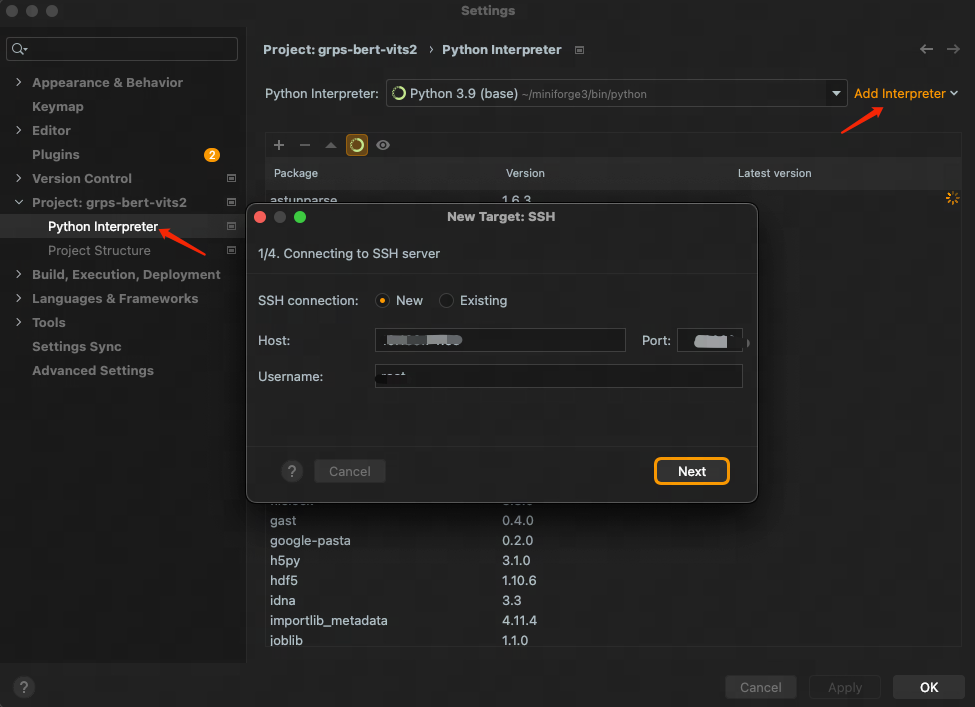
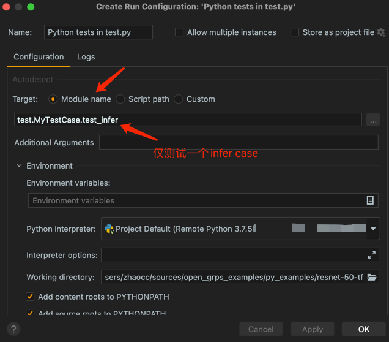

# Dlp环境开发

1. [Dlp镜像列表](#dlp镜像列表)
2. [Dlp环境开启](#dlp环境开启)
3. [创建自定义工程](#创建自定义工程)
4. [Pycharm远程链接Dlp环境开发](#pycharm远程链接dlp环境开发)
5. [Jupyter远程链接Dlp环境开发](#jupyter远程链接dlp环境开发)

## Dlp镜像列表

* harbor.cm.service.163.org/dlp-online/opengrps/grps_gpu:grps1.1.0_cuda10.1_cudnn7.6.5_tf2.3.0_torch1.8.1_py3.7_dlp
* harbor.cm.service.163.org/dlp-online/opengrps/grps_gpu:grps1.1.0_cuda10.1_cudnn7.6.5_tf2.3.0_torch1.8.1_py3.8_dlp
* harbor.cm.service.163.org/dlp-online/opengrps/grps_gpu:grps1.1.0_cuda11.8_cudnn8.6_tf2.12.0_torch2.1.2_py3.8_dlp
* harbor.cm.service.163.org/dlp-online/opengrps/grps_gpu:grps1.1.0_cuda11.8_cudnn8.6_tf2.12.0_torch2.1.2_py3.10_dlp

## Dlp环境开启

dlp启动时选择grps-dlp镜像即可，服务启动后可以使用ssh以及jupyterlab进行开发调试，如下：

```
Start Time           Status               ssh                              jupyter
2024-01-17T06:44:29Z Running              ssh root@10.189.74.32 -p 60000   http://10.189.74.32:50000
```

## 创建自定义工程

通过`grpst create`命令创建自定义工程，如下：

```bash
grpst create ./my_grps

# 选择自定义工程模板，如下提示，也可以直接使用--project_type参数指定。
Select project type.
[1] "py": python project with pytorch, tf and trt support.
[2] "cpp": c++ project without nn lib support.
[3] "cpp_torch": c++ project with libtorch support.
[4] "cpp_tf": c++ project with libtensorflow support.
[5] "cpp_trt": c++ project with libtensorrt support.
Please input number(1-5), default is "1":
```

参考[自定义工程](5_Customized.md)，进行自定义工程开发。

## Pycharm远程连接Dlp环境开发

我们可以进一步使用ide连接远程dlp环境使用容器中的环境进行开发和调试，同时也可以加入断点进行调试。我们通过git将自定义工程拉取到本地并使用pycharm打开并配置连接远程调试环境。

### 1. 配置远程解释器

1. 打开Pycharm，选择File->Settings->Project:xxx->Python Interpreter，点击右上角的齿轮，选择Add，选择SSH Interpreter。
2. 填写远程服务器信息，如下图所示：<br>
   
3. 选择远程解释器，如下图所示：<br>
   
4. 修改映射路径，打开自动上传，本地修改代码后会自动替换远程代码，如下图所示：<br>
   
5. 点击OK，完成配置，正确的解释器会显示如下：<br>
   
6. 之后等待pycharm同步完代码和环境后即可正常开发调试，书写代码会有代码提示。

### 2. 构建、运行与断点调试

1. 创建一个pytest配置，这里注意我们仅测试“_test.MyTestCase.test_infer_”一个case，如下图所示：<br>
   

   

2. 直接点击run即可，运行的即是我们的单测（test.py）,如下图所示：<br>
   

3. 断点调试仅需要我们在pycharm中加入断点后再点击debug即可，如下图所示：<br>
   

### 3. 也支持登录远程服务器

pycharm也可以直接登录远程服务器，如下图所示：<br>


## Jupyter远程链接Dlp环境开发

也直接登录使用web登录jupyter服务地址即可，如下图所示：<br>

