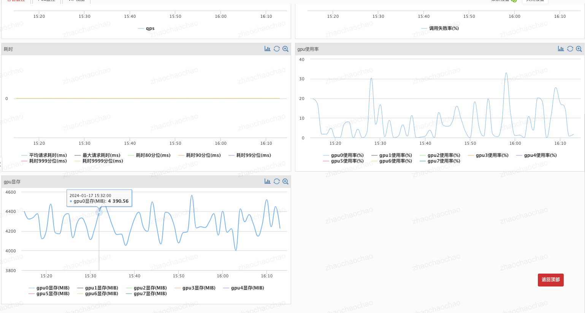

# Horizon部署

## open-grps基础镜像列表（内部源）

* harbor.cm.service.163.org/dlp-online/opengrps/grps_gpu:grps1.1.0_cuda10.1_cudnn7.6.5_tf2.3.0_torch1.8.1_py3.7
* harbor.cm.service.163.org/dlp-online/opengrps/grps_gpu:grps1.1.0_cuda10.1_cudnn7.6.5_tf2.3.0_torch1.8.1_py3.8
* harbor.cm.service.163.org/dlp-online/opengrps/grps_gpu:grps1.1.0_cuda11.8_cudnn8.6_tf2.12.0_torch2.1.2_py3.8
* harbor.cm.service.163.org/dlp-online/opengrps/grps_gpu:grps1.1.0_cuda11.8_cudnn8.6_tf2.12.0_torch2.1.2_py3.10
* harbor.cm.service.163.org/dlp-online/opengrps/client:1.1.0

## 自定义工程horizon镜像构建

在自定义工程的docker/Dockerfile基础上增加horizon所需环境，并切换基础镜像为内部仓库源，也可以设置启动超时时间，构建自定义工程horizon镜像。

例如python版本的自定义工程，修改如下：

```dockerfile
# --------Building stage.--------
# FROM registry.cn-hangzhou.aliyuncs.com/opengrps/grps_gpu:grps1.1.0_cuda10.1_cudnn7.6.5_tf2.3.0_torch1.8.1_py3.7 AS build
# >>>>>>>> 切换基础镜像为内部仓库源 <<<<<<<<
FROM harbor.cm.service.163.org/dlp-online/opengrps/grps_gpu:grps1.1.0_cuda10.1_cudnn7.6.5_tf2.3.0_torch1.8.1_py3.7 AS build

# grps archive.
RUN mkdir -p /my_grps
ADD conf /my_grps/conf
ADD data /my_grps/data
ADD src /my_grps/src
ADD requirements.txt /my_grps/requirements.txt
ADD test.py /my_grps/test.py
RUN cd /my_grps && \
    grpst archive . --skip_unittest --output_path server.mar

# --------Release stage.--------
# FROM registry.cn-hangzhou.aliyuncs.com/opengrps/grps_gpu:grps1.1.0_cuda10.1_cudnn7.6.5_tf2.3.0_torch1.8.1_py3.7
# >>>>>>>> 切换基础镜像为内部仓库源 <<<<<<<<
FROM harbor.cm.service.163.org/dlp-online/opengrps/grps_gpu:grps1.1.0_cuda10.1_cudnn7.6.5_tf2.3.0_torch1.8.1_py3.7

# Intall requirements.
ADD requirements.txt /tmp/requirements.txt
# 可以自行添加国内源，例如 -i https://pypi.mirrors.ustc.edu.cn/simple/ 
RUN pip install -r /tmp/requirements.txt

# >>>>>>>> 修改默认工作路径 <<<<<<<<
# WORKDIR /my_grps
# COPY --from=build /my_grps/server.mar /my_grps/server.mar
WORKDIR /home/appops/approot
COPY --from=build /my_grps/server.mar /home/appops/approot/server.mar
ENV LANG C.UTF-8

# >>>>>>>> 增加horizon所需环境 <<<<<<<<
RUN groupadd -g 60001 appops \
    && groupadd -g 60002 logger  \
    && useradd -u 60001 -d /home/appops -m -g appops appops \
    && useradd -s /bin/sh -u 60002 -g logger logger
RUN curl -#sSL -o /usr/bin/tini https://music-cloudnative.nos-jd.163yun.com/binary/tini-v0.19.0 && chmod +x /usr/bin/tini
RUN chown -R appops:appops /home/appops
ENTRYPOINT [ "tini", "--" ]
USER 60001

# >>>>>>>> grpst start server.mar可以跟上--timeout参数增加超时时间，默认为300s <<<<<<<<
CMD ["/bin/sh", "-c", "grpst start server.mar"]
```

## horizon配置

### 构建配置

选择从Dockerfile构建，并指定为自定义工程horizon dockerfile。

### 健康检查

* port：7080
* 存活状态：/grps/v1/health/live
* 就绪状态：/grps/v1/health/ready
* 上线：/grps/v1/health/online
* 下线：/grps/v1/health/offline

### 日志路径

修改server.yml配置文件，将日志路径修改为/home/appops/approot/logs，如下：

```yaml
# Log config.
log:
  log_dir: /home/appops/approot/logs # Log dir. Will be subdir of deploy path if is relative path.
```

### 哨兵配置

增加监控项，选择采集器为open_grps_monitor即可，其他配置可以使用默认配置。

### 监控观测

可以进入哨兵监控页查看open_grps_monitor监控项，如下：<br>


也可以单独访问某一个pod的监控页，即http://pod_ip:7080/，如下：<br>

